# 助听盒项目

## 软件资料

- CORE：STM32H743VIxxHAL_Lib
- DSP：V1.8 2019

### 硬件资料

- DAC：CS43131 I2S
- MIC：ICS-43434 SAI-->I2S

## 编程注意事项

### 类型转换

算法中存在数据类型转换：如`int`转`float`对于有符号的转换应使用有符号数据进行跨类型转换

以下转换将失去符号，导致预取数据存在问题：

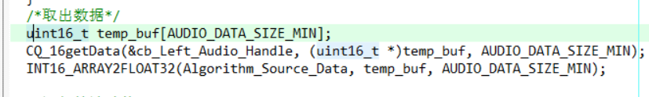

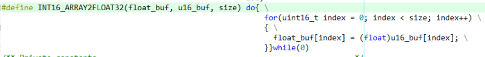

以上流程原意：取出环形缓冲区中的数据到`temp_buf`中因环形缓冲区存放的是==uint16_t==类型所以临时buf也声明了uint16_t类型，再将整形数据转为浮点型时使用了强制类型转换==(float)==，不过结果丢失了符号位，数据完全失真。

下面为正确修正：

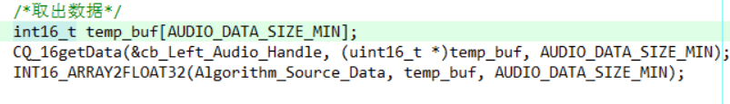

### 驱动WM8978

与WM8978的通讯涉及两个：音频数据传输接收、控制传输。音频数据使用SAI接口I2S协议，控制传输使用I2C接口。

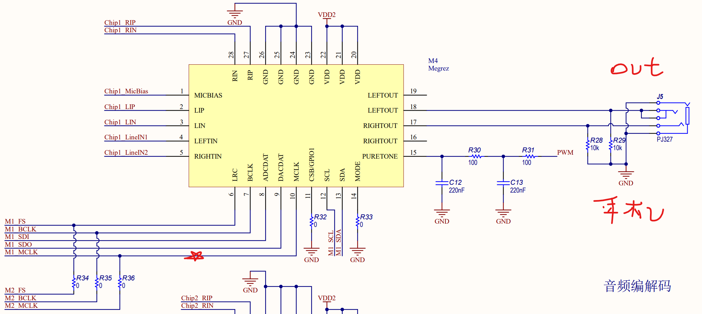

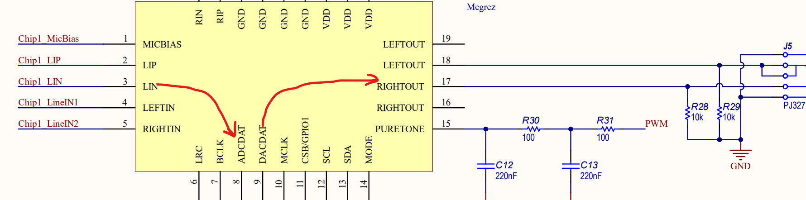

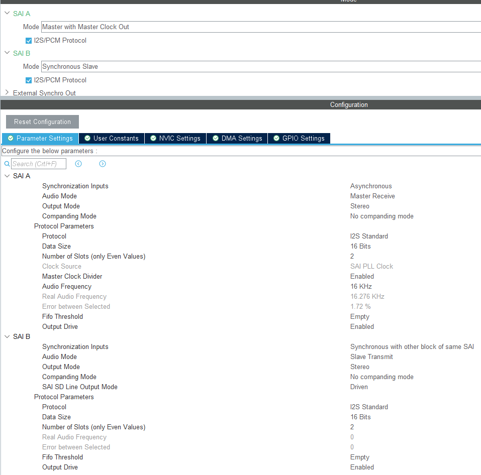

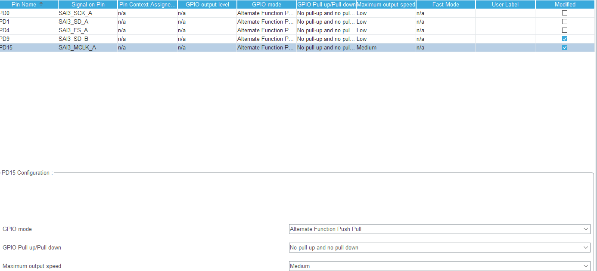

SAI通讯时涉及`FS`,BCLK,`SDI`,MCLK，其中MCLK（主时钟输出）需要注意与通讯速率的配合选择引脚速率，否则导致数据异常，或者无数据情形！

### 不可在接收完成中断中处理数据

- 不可对数据接收有延时
- 注意数据串扰

## 优化加速

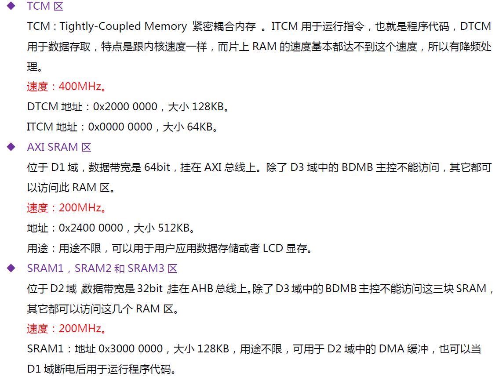

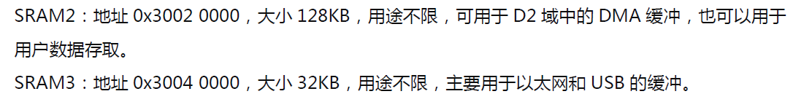

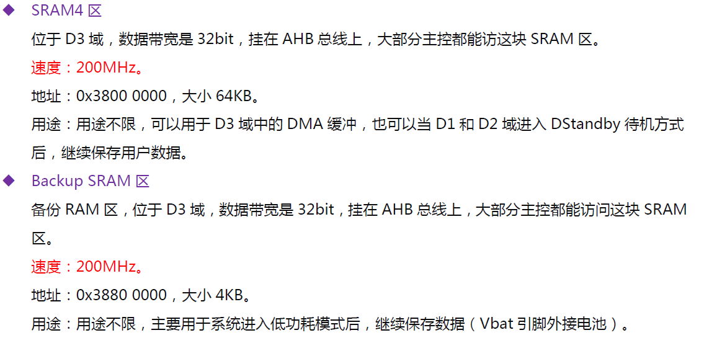

### 对低速区加速主要涉及配置MPU设置相关模式

#### Cache方式加速

==注意带有Cache加速的单片机，如STM32H743一般默认开启Cache，此时若定义变量（DMA的接收缓冲区）必须定义MPU设置接收区地址的访问规则，对于用于DMA的缓冲区最好开启S，保证数据访问一致性==，调试先关闭Cache，功能正常后，使能Cache按需加速，可以解决多数前期Cache配置导致的数据异常问题。

频繁操作的音频数据区域分配到低速区即主SRAM，之后启用MPU配置对其加速，使用==16K Cache区域==

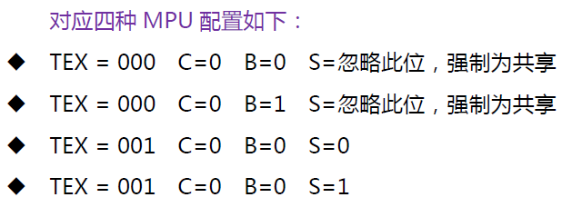

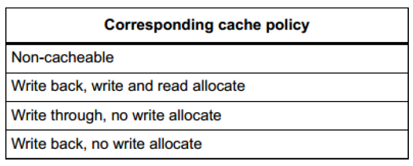

```c
/*
TEX用于配置Cache策略,支持如上四种情况，需要配合C和B位的配置才能实现。
C位对应的HAL库MPU参数如下，用于使能或者禁止Cache。PS:只要使能此位，read allocate就是开启的，也就是Cache读不到就分配Cache
B位对应的HAL库MPU参数如下，用于配合C位实现Cache模式下是否使用缓冲。
S位对应的HAL库MPU参数如下，用于解决多总线或者多核访问的共享问题。PS：该位对读取性能影响非常大！！！
*/
void MPU_Config(void)
{
  MPU_Region_InitTypeDef MPU_InitStruct = {0};

  /* Disables the MPU */
  HAL_MPU_Disable();
  /** Initializes and configures the Region and the memory to be protected
  */
  MPU_InitStruct.Enable = MPU_REGION_ENABLE;
  MPU_InitStruct.Number = MPU_REGION_NUMBER0;
  MPU_InitStruct.BaseAddress = 0x24000000;
  MPU_InitStruct.Size = MPU_REGION_SIZE_512KB;
  MPU_InitStruct.SubRegionDisable = 0x0;
  MPU_InitStruct.TypeExtField = MPU_TEX_LEVEL1;//T ==> 1
  MPU_InitStruct.AccessPermission = MPU_REGION_FULL_ACCESS;
  MPU_InitStruct.DisableExec = MPU_INSTRUCTION_ACCESS_ENABLE;
  MPU_InitStruct.IsShareable = MPU_ACCESS_NOT_SHAREABLE;//S ==> 0
  MPU_InitStruct.IsCacheable = MPU_ACCESS_CACHEABLE;//C ==> 1
  MPU_InitStruct.IsBufferable = MPU_ACCESS_BUFFERABLE;//B ==> 1

  HAL_MPU_ConfigRegion(&MPU_InitStruct);
  /** Initializes and configures the Region and the memory to be protected
  */
  MPU_InitStruct.Enable = MPU_REGION_ENABLE;
  MPU_InitStruct.Number = MPU_REGION_NUMBER1;
  MPU_InitStruct.BaseAddress = 0x38000000;
  MPU_InitStruct.Size = MPU_REGION_SIZE_64KB;
  MPU_InitStruct.SubRegionDisable = 0x0;
  MPU_InitStruct.TypeExtField = MPU_TEX_LEVEL1;//T ==> 1
  MPU_InitStruct.AccessPermission = MPU_REGION_FULL_ACCESS;
  MPU_InitStruct.DisableExec = MPU_INSTRUCTION_ACCESS_ENABLE;
  MPU_InitStruct.IsShareable = MPU_ACCESS_SHAREABLE;//S ==> 1
  MPU_InitStruct.IsCacheable = MPU_ACCESS_CACHEABLE;//C ==> 1
  MPU_InitStruct.IsBufferable = MPU_ACCESS_NOT_BUFFERABLE;//B ==> 0

  HAL_MPU_ConfigRegion(&MPU_InitStruct);
  /* Enables the MPU */
  HAL_MPU_Enable(MPU_PRIVILEGED_DEFAULT);
}

/* 发送缓冲区 2xFrameLength */
__attribute__ ((at(0x38001000))) volatile uint16_t SAI_TX_Buf_0[STEREO_FRAME_SIZE] = {0};
__attribute__ ((at(0x38002000))) volatile uint16_t SAI_TX_Buf_1[STEREO_FRAME_SIZE] = {0};
/* 接收缓冲区 2xFrameLength */
__attribute__ ((at(0x38003000))) volatile uint16_t SAI_RX_Buf_0[STEREO_FRAME_SIZE] = {0};
__attribute__ ((at(0x38004000))) volatile uint16_t SAI_RX_Buf_1[STEREO_FRAME_SIZE] = {0};
```


#### DTCM加速与ICTM加速

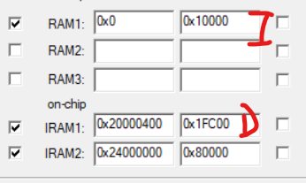

对于大量数据的文件选择它的数据区域：D加速区

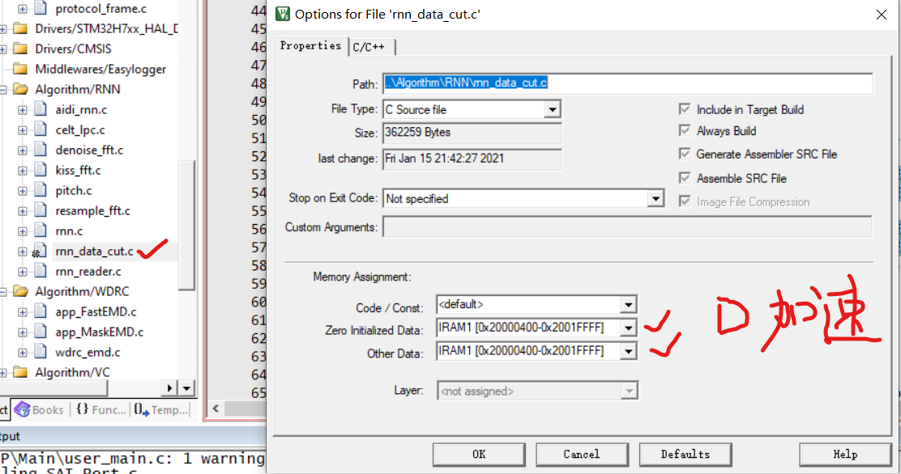

包括中断向量表：

```c
/**
  ******************************************************************
  * @brief   中断向量表拷贝到D加速区0x20000000
  * @param   [in]None
  * @return  None.
  * @author  aron566
  * @version V1.0
  * @date    2020-01-18
  ******************************************************************
  */
void User_InterruptVectorTable_Move(void)
{
  uint32_t *SouceAddr = (uint32_t *)FLASH_BANK1_BASE;
  uint32_t *DestAddr = (uint32_t *)D1_DTCMRAM_BASE;
  memcpy(DestAddr, SouceAddr, 0x400);
  /* 设置中断向量表到 ITCM 里面*/
  SCB->VTOR = D1_DTCMRAM_BASE;
}
```


对于操作指令使用I加速区：

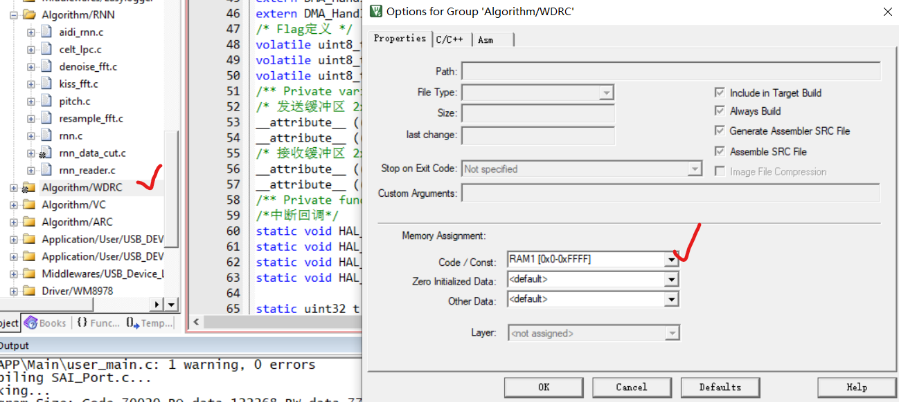

## 编译问题

- AIDI_STM32H743VIT_PRJ\AIDI_STM32H743VIT_PRJ.axf: error: L6787U: Region table handler '__scatterload_copy' needed by entry for RW_IRAM1 was not found.
- 使用微库


## 运行问题

噪声：时延是噪声发生的主要原因