# STM32H743VIT6 PDM2PCM

## 关于Cache加速

[Cache加速资料](AboutCache/readme.md)

## 音频外设术语定义

### MCLK主时钟

该时钟输出频率 256 × FS或者384 x FS，其中 FS 为音频信号 采样频率

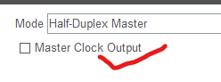

### 串行时钟频率SCLK

又叫位时钟频率BCLK，采集bit的速率，以PCM数字幅值编码的音频流数据，16bit代表一个状态幅值，2个字节
SCLK的频率=2×采样频率×采样位数

### stereo 立体声

立体声就是拥有左右声道的音频流数据，Mono单声道

### PCM
脉冲幅值编码
16bit长度，有符号位，就是有±

### PDM

脉冲密度编码
1bit长度，只有0，1

### 帧时钟LRCLK也称WS采样率
用于切换左右声道的数据。
LRCLK为“1”表示正在传输的是右声道的数据
LRCLK为“0”表示正在传输的是左声道的数据
LRCLK的频率等于采样频率。

使用场景
需要采样率为16khz的音频流数据，即帧时钟为16khz，1ms一帧音频数据
无论编码方式是PCM还是PDM都是串行通讯数据都是bit采样(即在SCLK的时钟的上升沿或者下降沿采样，确定当前的数据为1或者0)，不过最后组成的数据意义不同，PCM直接就是幅值，而PDM则需要转PCM

因为编码方式的不同对一帧的定义就不同了
PCM为16bit为一帧
PDM因为需要转PCM涉及到数据抽取(即例如在PDM转PCM的软件调用接口中规定需要16khz的PCM数据时，需要8个字节的PDM数据输入，输出一个PCM数据，所以这时PDM就需要8*8=64bit的数据为一帧)
这时的采样率，注意采样率16khz，1ms，16帧

WS是单片机的输出引脚--->连接传感器的WS的换数据脚，通常传感器的厂家会有一份传感器数据手册**DataSheet**

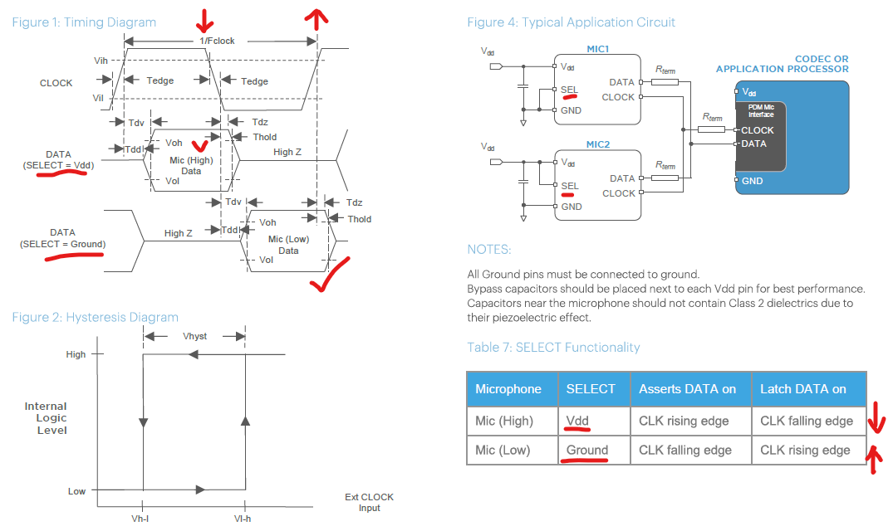

可以看到2号传感器SEL接地，单片机在串行时钟的的上升沿采样取得的是2号传感器1bit数据，1号传感器SEL脚接高电平，单片机在串行时钟的下降沿采样取得的是1号传感器1bit数据。

有些外设如SAI接口的外设选择PDM接口，则没有WS脚，WS脚存在于I2S协议中，就是用于连接传感器的WS脚或者其他名称的脚，这个脚的功能就是`传感器检测到WS高电平了`说明主机要右声道数据了。此时L/R脚上拉至高的传感器输出有效数据（即设置传感器在什么边沿，输出哪种声道的数据）。

ws采样率的设定就是设定读取某一声道的时间，控制在采样率范围内，读取下一声道就切换输出高电平或输出低电平

如果原始数据，PDM编码，需转为16khz PCM编码数据，接口要求8字节PDM数据输出一帧PCM

其比值PCM 16bit : PDM 64bit

数据接口连接两个mic，即双声道，ws连接SEL脚，我们的串行时钟频率应为：SCLK = 64bit一帧 * 2声道 * 16khz采样率 = 2.048mhz

这个时钟频率可以1ms得到2048个bit，包含两个声道的数据，得到一个声道的数据，再除以2 = 1024个bit，换算成帧1024/64 = 16帧即每通道1ms采集16帧数据，采样率为16khz。

# SAI接口

## SAI Introduction SAI 介绍

The SAI interface ( Serial Audio Interface) is a peripheral supporting a wide set of audio protocols thanks to its flexible architecture:

- I2S Philips standards, (Inter-IC Sound), 

- I2S LSB or MSB-justified, (Variant of Inter-IC Sound),

- SPDIF Output, (Sony/ Philips Digital Inter Face) 

- PCM, (Pulse Code Modulation) 

- TDM, (Time Division Multiplexing) 

- AC’97, (Audio Codec ’97 from Intel)

### SAI Features(1/2)

A SAI embeds two independent audio sub-blocks which can be:

- Transmitter and/or receiver 
- Master or slave 
- Synchronous or asynchronous mode between the audio sub-blocks 
- Clock generator for each audio sub-block to target independent audio frequency sampling

- 8-word integrated FIFOs for each audio sub-block. 
- Up to 16 slots available 
- Mute mode 
- Stereo/Mono audio frame capability. 
- Companding mode supporting µ-Law and A-Law.

### SAI Features(2/2)

- Flexible serial interface: 
- Configurable data justification (LSB or MSB first), 
- Configurable data and slot size, 
- Configurable sampling edge for the Communication clock, 
- Configurable number of bits per frame, 
- Configurable data position within a slot, 
- Configurable frame synchronization active level, 
- Configurable frame shape 
- 2 DMA interfaces : one for each audio sub-block 
- 2 Interrupt lines: one for each audio sub-block

### SAI Block Diagram

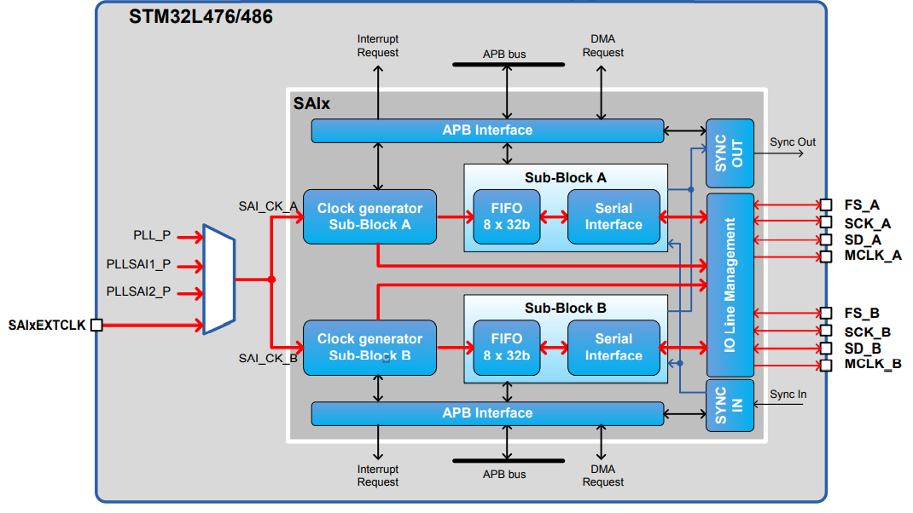

|     Signal     | Dir  |                         Description                          |
| :------------: | :--: | :----------------------------------------------------------: |
|   FS_A, FS_B   | I/O  |                    Frame synchronization                     |
|  SCK_A, SCK_B  | I/O  |              Bit clock sampling the serial data              |
|   SD_A, SD_B   | I/O  |                         Serial Data                          |
| MCLK_A, MCLK_B |  O   | Master Clock: can be requested to provide a clock to external codecs |

### SAI In The System

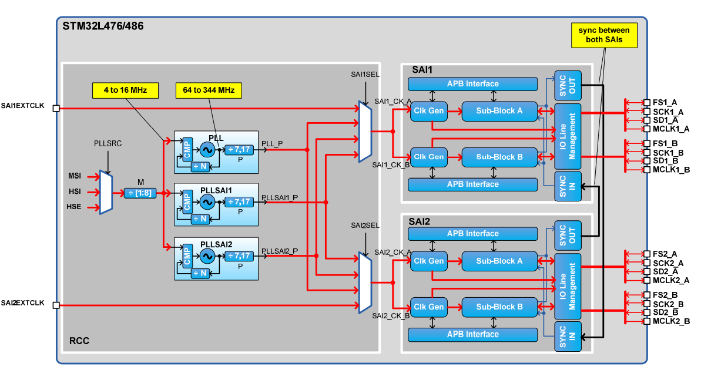

### SAI: Internal Synchronization examples (1/3)

- Synchronization of 2 sub-blocks
- MASTER full-duplex or dual lane
- SLAVE full-duplex or dual lane

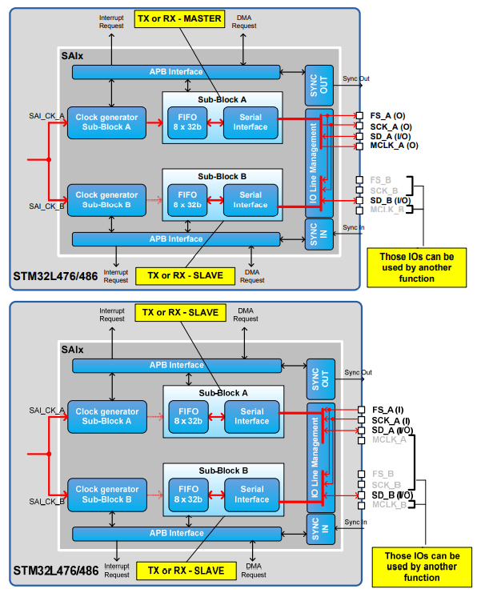

### SAI: External Synchronization examples (2/3)

- Synchronization of 2 SAIs 
- Up to four data lanes can work simultaneously

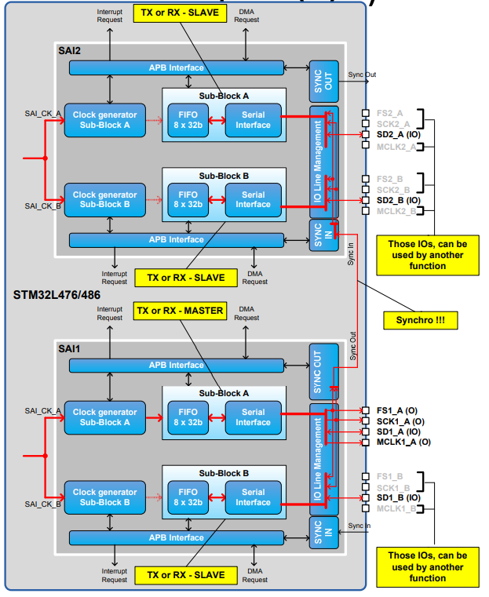

### SAI: Synchronous mode examples (3/3)

• Several other configurations are supported:

- If the internal and external synchronization is not used, each sub-block is independent. Some examples:
  - SAI_A in I2S Philips Master, SAI_B in SPDIF 
  - SAI_A in TDM SLAVE, SAI_B in AC97

- If the internal or external synchronization is used, the following limitations must be respected:
  - It is not possible to synchronize 2 SAI Sub-Blocks using different protocols characteristics. 
  - It is not possible to synchronize 2 SAIs using different protocols characteristics.

### FIFO Feature

- Each audio block in the SAI has its own FIFO 
- FIFO depth is 8 words 
- CPU or DMA access to the FIFOs 
- Data is right-aligned into the FIFO. 
- FIFO FLUSH bit to reinitialized the FIFO pointers 
- Each access in read from the FIFO will return a word (32- bit) equivalent to one data 
- Each write into the DR will correspond to the FIFO to one data. 
- Programmable FIFO threshold to manage data transfert: – FIFO FULL, ¾ FIFO, ½ FIFO, ¼ FIFO, FIFO EMPTY

### Free Protocol Description

The Free protocol (PRTCFG = 0) must be selected to configure the SAI in: 

- I2S Philips Standard mode 
- I2S MSB/LSB justified 
- TDM mode 
- PCM mode

### Audio Clock configuration

- The clock generators are used only in MASTER mode.

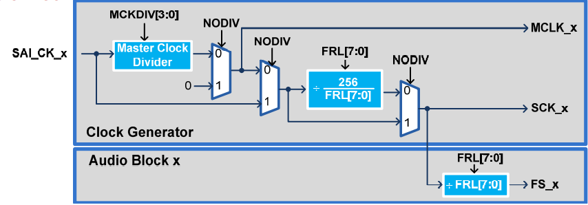

When MCLK is generated (NODIV = 0)，When MCKDIV = 0 FMCLK = FSAI_CK

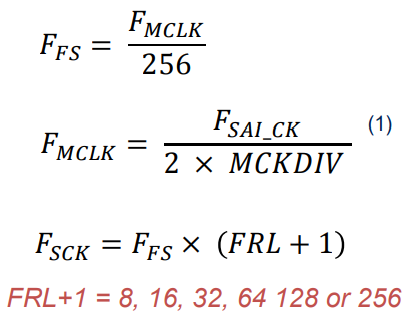

 When MCLK is not generated (NODIV = 1)

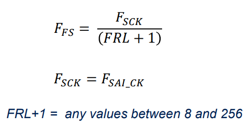

### Frame synchronization (1/2)

Adjustable parameters

- The Frame length (FRL) 

- The Frame active length (FSALL) 

- The Frame polarity (FSPOL) 

- The Channel side identification (FSDEF) 
- The Frame offset (FSOFF)

### Frame synchronization (2/2)

- The FS signal shape is completely configurable in order to target the different audio protocols with their own specificities. 

- The Frame Synchronization signal (FS) role depends on audio protocol: 

  - Start of frame, like for instance the PCM/DSP, TDM, AC’97, audio protocols, 

  - Start of frame and a channel side identification within the audio frame like for the I2S, the MSB or LSB-justified protocols 

    

    

- The Frame synchronization active length can be set from 1 to 128 bit clock. 

- The FS active length is usually:

  - Half of the frame length in I2S, LSB or MSB-justified modes 
  - one-bit wide for PCM/DSP or TDM mode 
  - 16-bit length in AC’97

### Frame length

- Master mode:

  - The audio frame length can be configured up to 256 bit clock, 

  - If the frame length is greater than the number of declared slots for the frame, the remaining bits to be transmitted will be extended to 0 or the SD line will be released to HI-z depending the state of bit TRIS in the SAI_xCR2 register. In reception mode, the remaining bits are ignored.
- Slave mode: 
  - The audio frame length must be used in order to specify to the slave the number of bit clocks per audio frame sent by the external master. This feature can be used to detect signal quality errors.
    - FS transitions are automatically monitored in order to detect a wrong placement of the start of frame by generating either an anticipated or late frame synchronization detection.

### Audio Slot configuration(1/2)

- The maximum number of slots per audio frame is fixed to 16
  - Configured through bits “NBSLOT[3:0] in the SAI_xSLOTR register +1”.
- Each slot can be defined as an active slot, or not
  - By setting bit SLOTEN[15:0] in the SAI_xSLOTR register.
- The size of the slots is selected by setting bit SLOTSZ in the SAI_xSLOTR register.
- It is possible to define the data position into the slot (FBOFF)

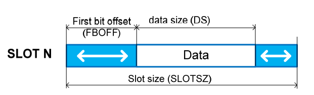

### Audio Slot configuration(2/2)

- During the transfer of a inactive slot, 0 value will be forced on the SD line or the SD line will be released to HI-z depending on TRIS bit setting in the SAI_xCR2 register

  👉No request to read or write the FIFO linked to this inactive slot

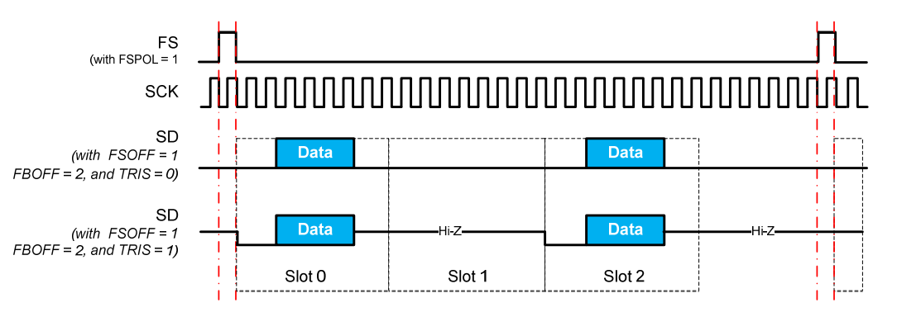

### Specific Feature: Mute Mode

- SAI Transmitter: 
  - Mute mode can be selected at anytime during an on-going frame
  - Mute mode starts by setting the MUTE bit in SAI_xCR2 register:
    - The mute mode bit is strobed only at the end of the frame to determine if the next frame will be a mute frame or not.
  - During Mute mode:
    - The FIFO pointers are still incremented.
    - SAI still sending bit value 0 or Last values depend of MUTEVAL bit setting in SAI_xCR2 
- SAI Receiver: Mute mode starts by setting the MUTE bit.
  - A frame is detected as MUTE when all the active slots have been strobed with only 0 on SD line in input. 
  - FLAG MUTEDET is set and an interrupt generated (if enabled), when the number of consecutive Mute frame is equal to number set into MUTECNT bits In SAI_xCR2 .

### Specific Feature: Companding Mode

- Two companding modes are supported: μ-Law and the A-Law log which are a part of the CCITT G.711 recommendation
- The companding standard employed in the United States and Japan is the μ-Law and allows 14 bits bits of dynamic range
- The European companding standard is A-Law and allows 13 bits of dynamic range.
- The μ-Law and A-Law formats encode data into 8-bit code elements with MSB alignment. 👉Companded data is always 8 bits wide
- Companding standard (μ-Law or A-Law) can be computed based on 1’s complement or 2’s complement representation depending on the CPL bit setting in the SAI_xCR2 register.

### Specific Protocol Description

- SPDIF Protocol
- AC’97 Protocol

### SPDIF Protocol (1/5)

The SAI can provide audio samples using SPDIF protocol.

- To select the SPDIF protocol, set PRTCFG[1:0] in the SAI_xCR1 register to 01. 

- On SPDIF mode, only SD_x IO is used, other IOs are free.
- The data size is forced to 24 bits.
- The data are Manchester encoded (or biphase-mark)
- The SAI generates automatically the preambles
- The SAI generates automatically the parity
- – The application has to handle the CS, U and V bit

### SPDIF Protocol (2/5)

- Symbol Rate:

  - The audio sample rate (F S) can be adjusted using the following formula:

    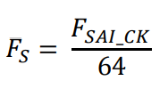

| F_SAI_CK   | Audio sample rate |
| ---------- | ----------------- |
| 2.8224 MHz | 44.1 kHz          |
| 3.072 MHz  | 48 kHz            |
| 6.144 MHz  | 96 kHz            |

- Data format:

  - The data register must contain CS,U and V bits, plus the data

  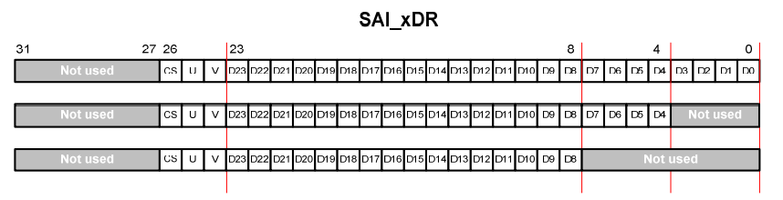

### SPDIF Protocol (3/5)

- The block structure is used to organize the Channel Status, and User information.
  - Each block contains 192 frames
  - Each frame contains 2 sub-frames
  - Each sub-frame contains 32 bits
  - A preamble allows the detection of the block and sub-frame boundaries
    * Preamble B detects the start of new block, and the start of a Channel A
    * Preamble M detects the start of a Channel A (when it is not a block boundary)
    * Preamble W detects the start of a Channel B

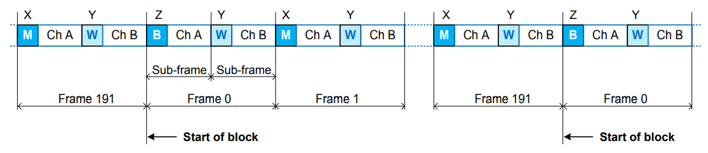

### SPDIF Protocol (4/5)

- Each sub-frame contains 
  - The preamble
  - Up to 24-bit data
  - 4 Status bits
    - **V** is the validity bit, it means that the current sample can be directly converted into an analog signal.
    - **P** is the parity bit of the received sub-frame, it is used to check the received sub-frame
    - **U** Is the User data channel, each message is composed of 192 bits
    - **CS** Is the Channel Status, each message is composed of 192 bits (i.e. sampling rate, sample length….)

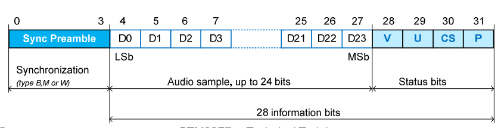

### SPDIF Protocol (5/5)

- Biphase-mark data encoding

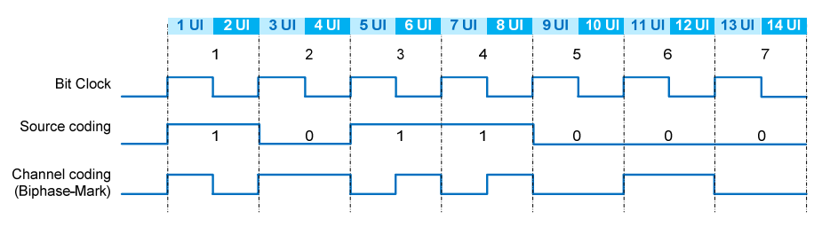

- Preambles

  - The preambles are ‘violating’ the biphase-mark code rules

  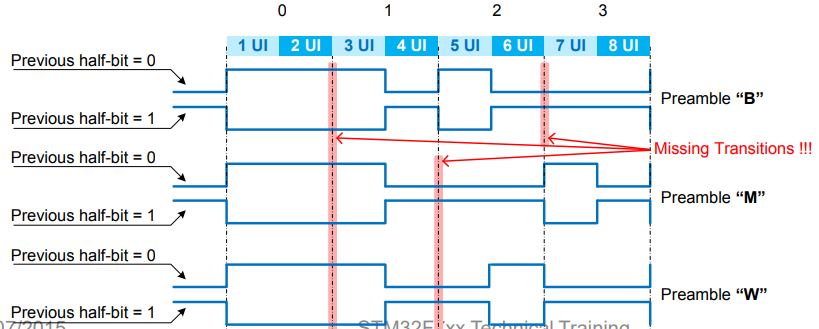

### AC’97 protocol(1/2)

- The SAI is able to work as an AC’97 link controller. 
  - To select the AC 97 protocol, set bit PRTCFG[1:0] in the SAI_xCR1 register to 10. 
- The number of slot is fixed to 13 slots:
  - Tag slot :slot 0 (16-bit),
  - Data slots: slot 1 to slot 12 (20-bit) 
  - Bit FBOFF[5:0] in the SAI_xSLOTR register is ignored
- The frame length is fixed to 256-bit
  - The SAI_xFRCR register is ignored

### AC’97 protocol(2/2)

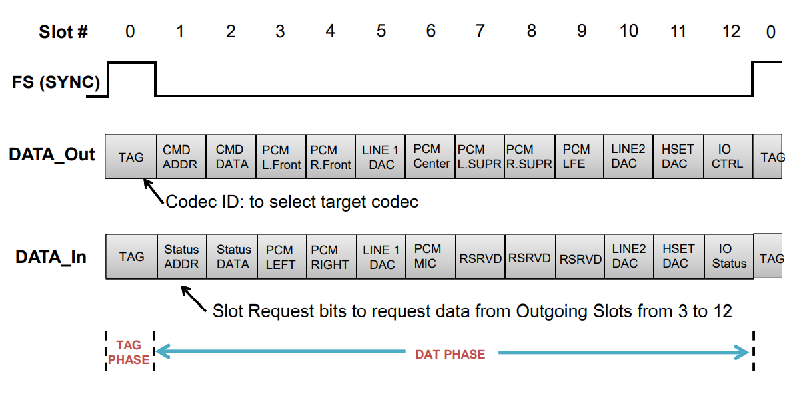

### Anticipated/Late Frame Error

- In SLAVE mode, the FRL must be programmed according to the frame length provided by the MASTER.

- FRL value is also used to check if the FS active edge occurs at the expected moment. Anticipated or Late FS error can be detected.

- To resynchronize with the master after Anticipated or Late frame detection error, four steps should be respected:

  1. **Disable the SAI (SAIxEN = 0)**

  2. **Flush the FIFO**
  3. **Re-enable the SAI**

**SAI block will wait for the assertion of FS** to restart the synchronization with master

This detection and flag assertion can detect glitches on the SCK Clock/FS due to a noisy environment

### Overrun/Underrun handling

- The FIFO overrun or underrun errors **occupy the same bit: OVRUDR**
- The **SAI guarantees the data alignment** even if underrun overrun occurs
- Example : FIFO Overrun on Slot 1

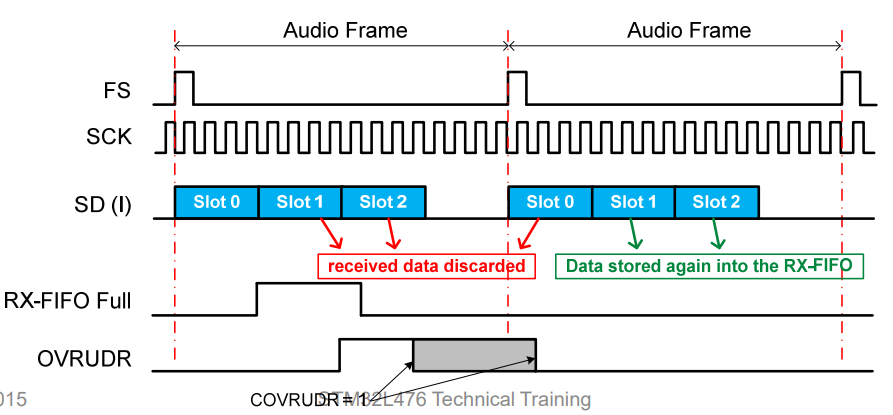

### SAI Interrupt Sources

| Interrupt source | Interrupt group | Description                           | How to clear interrupt    |
| ---------------- | --------------- | ------------------------------------- | ------------------------- |
| FREQ             | FREQ            | FIFO request (FIFO threshold reached) | SAI_xDR read or write (2) |
| OVRRUDR          | ERROR           | Overrun/Underrun error                | COVRUDR = 1               |
| AFSDET           | ERROR           | Anticipated frame sync. detected      | CAFSDET = 1               |
| LFSDET           | ERROR           | Late frame sync. detected             | CLFSDET = 1               |
| CNRDY            | ERROR           | Codec Not Ready (only in AC’97 mode)  | CCNRDY = 1                |
| WCKCFG           | ERROR           | Wrong frame length configuration (1)  | CWCKCFG = 1               |
| MUTEDET          | MISC            | Mute detection                        | CMUTEDET = 1              |

(1) When WCKCFG is set to 1, the SAI is automatically disabled (SAIxEN=0)

(2) More precisely, when the FIFO level is below the threshold

### I2S Philips Standard at 48 kHz, MASTER

- F_SAI_CK = 12.288 MHz

| Field name | Values | Comments                                                |
| ---------- | ------ | ------------------------------------------------------- |
| MCKDIV     | 0      | No division                                             |
| NODIV      | 0      | Generation of the MCLK                                  |
| CKSTR      | 1      | Signal changed on falling edge                          |
| DS         | 5      | 20-bit data size                                        |
| SYNCEN     | 0      | No need to sync the two SAI sub-blocks                  |
| LSBFIRST   | 0      | MSb first                                               |
| MODE       | 0      | Master transmitter                                      |
| PRTCFG     | 0      | Free protocol for I2S                                   |
| FRL        | 63d    | 64 bits per frame (must be a power of 2 !!)             |
| FSALL      | 31d    | 32 bits on each channel                                 |
| FSOFF      | 1      | First bit starts 1 bit after FS transition              |
| FSPOL      | 0      | FS is active LOW                                        |
| FSDEF      | 1      | Side channel identification activated for right channel |
| FBOFF      | 0      | No data offset inside the slot                          |
| SLOTSZ     | 2      | Slot size = 32 bits                                     |
| NBSLOT     | 1      | 2 slots structure (Left + right)                        |
| SLOTEN     | 3      | Slot 0 and Slot 1 are used and enabled                  |

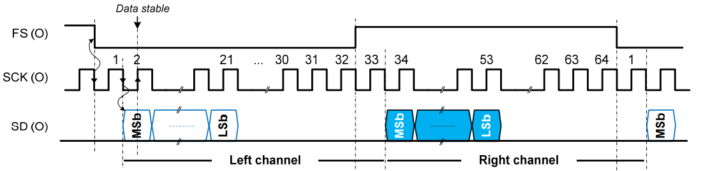